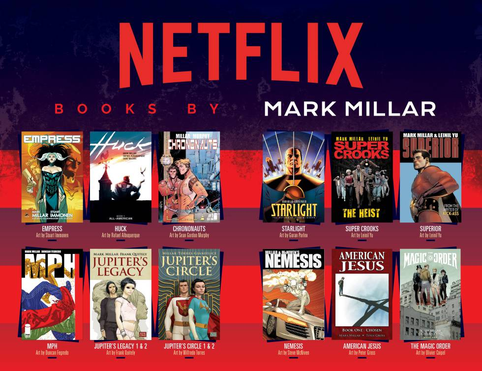

It is no surprise to anyone that books make fantastic movies and television series, since book to film adaptations dominate the market. But you might be surprised to hear how well these adaptations do. Film adaptations yield 53% more revenue globally than films from original screenplays and they dominate the market with 70% of the world’s top 20 grossing films being based on books. 

So, books support the film industry but does the film industry return the favour? The answer is a resounding yes. Some industry professionals even believe that; 

> “movies could be the unexpected saviour of the publishing profession” (Chapman, 2014). 

Results of adaptations on book sales vary considerably from book to book but the overall effect is a positive one. 

## Netflix’s Bridgerton

A Hollywood movie adaptation almost guarantees a book a spot in the New York Time Bestsellers list. 
A recent example of this phenomenon is the Netflix adaptation of Julia Quinn’s regency-era romance novels, *Bridgerton*. The Bridgerton series was released on Netflix on the 25th of December 2020. Less than a month later its publisher, Harper Collins’s Avon, reports a total of 750,000 books from the series sold. The nine book series has since all been on the Amazon’s top 25 bestselling eBooks. 

Another example is how the film adaptation of Daphne Du Maurier’s *My Cousin Rachel* increased book sales in 2017, when the film was released. Sales increased so significantly that in 2017 the book sales accounted for 23% of all book sales since the popular book was released in 1992. 

## Film Tie-In Book Covers

When a popular book becomes a major motion picture publishers will change the book’s cover to include images of promotion from the film. Or, at the very least a big sticker announcing its adaptation. 
It is relatively cheap for publishers to publish a new edition of the book with the films poster or actors on the front and it is definitely worth it. 

Film tie-in editions draw in more people who otherwise would not of read the book due to the popularity of a Hollywood adaptation. It will also ensure that the book receives first-rate advertising, as a popular film adaptation means booksellers will place the books face up on tables or in special displays. They will also feature in not just major chain bookstores but also airports, railways and supermarkets. 
The increased sales for bookstores means that they will choose to stock the film tie-in editions almost exclusively over the original editions. 

## Original Cover vs. Film Edition

Many bookworms detest film tie-in book covers. They believe them to look inferior and lack personality and creativity. This may be true as these editions are designed to be overt in order to encourage new readers who prefer to stick to watching films.
However, the number of people who dislike film tie-in editions and so who will refuse to buy them is very small compared to the amount of new buyers these editions bring in. These new editions 100% result in increased sales and as the publishing industry is used to working within small margins they must do whatever the majority of their audience wants in order to drive sales up.\
To try and please everyone though, some publishers will add eye-catching stickers to original editions announcing the book as a major motion picture adaptation. 

Some booksellers have also said that many customers get confused by film tie-in editions. When the book is published with the film tie-in cover some people believe that the content inside has been altered to follow the adaptation more closely. This does not happen and so adding a sticker to the original cover could help rectify this problem and satisfy the ‘book snobs’ all in one move. 

Whether you love them or hate them, film tie-in covers are the new norm for publishing in the Netflix era. And the effect that they have on the publishing industry is so significant that it cannot be anything but a success. 
It is easy to predict that the publishing industry will soon be working in tandem much more closely with production giants such as Netflix. 
In fact, it is already happening, with Netflix acquiring the indie comic book publisher, Millarworld, in 2017. This acquisition means that Netflix will have all the film and television rights to Millarworld’s future publications.

I for one, look forward to seeing many more of my favourite books adapted for the big screen in time.