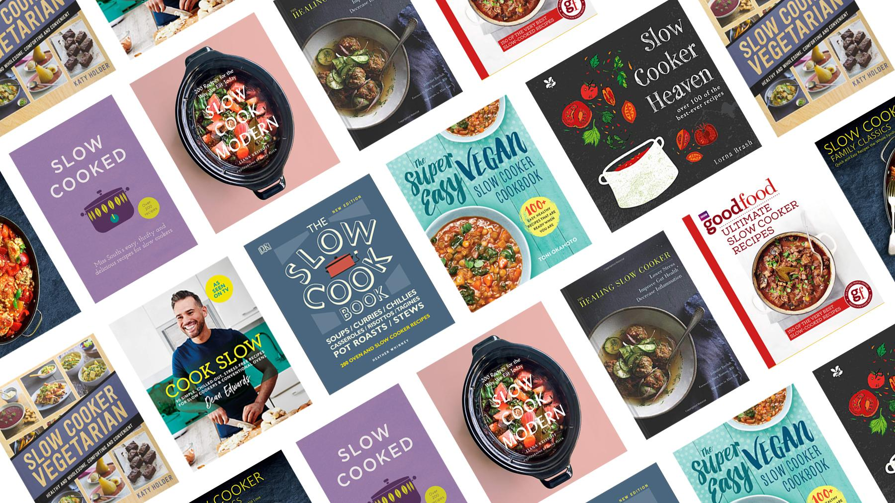
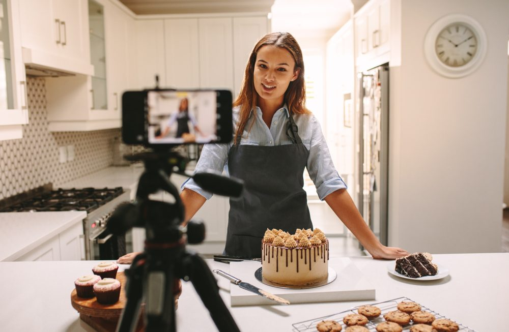

Coronavirus and multiple global lockdowns have changed the scene of home cooking. One year ago, Millennials and Generation Z were likely to be seen dining out frequently. However, due to restaurants being closed to the public or only available for limited seating due to new health guidelines, younger consumers are being forced to prepare more meals at home. This means that a new generation of cooks are being forced to spend more time doing grocery shopping, planning their weekly meals and learning new skills in the kitchen. 

So, for many first-time cooks it might be a challenging and tedious time in the kitchen. And to a younger generation that were raised in the convenience of the digital age, they will be looking for simple and time saving solutions in the kitchen too. The easier the better! 

## Where to Find Recipes?

A Google survey found that 59% of 25 to 34-year-olds cook with their smartphones or tablets at hand. They may be using them to surf YouTube cooking how-to channels for tips on how to portion your chicken, or using them to look at a recipe online. Recipes can be found on restaurants and chefs’ websites, on open sources and in eBooks or on free cooking apps. 

> Chris McBride says “Nearly all cooks these days, both casual and serious, look to the internet for recipes and cooking instruction. The sheer convenience of having countless free recipes (many in fact cribbed from cookbooks) available on your computer, tablet, and mobile phone is hard to compete with”.

## Do People Still Buy Physical Recipe Books?

Despite the fascination with digital solutions, recipe books are still among the top selling physical books every year. Publisher's Weekly reports that sales of print recipe books rose 21% in 2018 compared with 2017. Readers seem to want physical recipe books. If they don't actually use them in their kitchens, they use them as reference tools, for reading enjoyment due to their beautiful style and quality as well as for aspirational living. 
Novice cooks also appreciate that recipes found in a physical recipe book have been tried and tested by professionals and so can guarantee fantastic tasting food. This is unlike many recipes found on the internet which may have incorrect quantities or ingredients ordered incorrectly. 

Physical recipes may also provide practical advantages over digital recipes as there are many shortcomings when using technology in cooking. Screens may dim and power off when you need them most, your hands might be dirty or it could be tedious having to scroll around to look at both the ingredients and the instructions. It’s also safer to have a  recipe book on the counter as accidents happen in the kitchen, things get spilled and dropped all of the time. 

## Where to Learn How?

The global pandemic has forced many people to step out of their comfort zones and step into the kitchen. It is not just a practical pastime as you can’t be dining out with your friends every night now but it is also a new hobby that can be lots of fun and a good way to while away your excess time. 
However, for many first-time cooks there are many new skills and technical terms that come with following a recipe that you may not be aware of yet. And seeing how we’re prevented from reaching out to our mums or grandmothers to teach us how to “fold in egg whites gently”, we need someone to teach us virtually.

In the digital age of cooking there are a plethora of websites, food blogs and YouTube channels to teach you all the tips of the trade and to make cooking at home simple and fun. These digital sources are very popular amongst young foodies, with YouTube's largest food channel, [Tasty](https://www.youtube.com/channel/UCJFp8uSYCjXOMnkUyb3CQ3Q), having over 20 million subscribers. YouTube announces that the phrase “How to Cook...” is one of the top 10 how-to searches on the platform. These cooking pages aren’t just for experts either, they have everything available to help a novice chef grow in the kitchen. A simple example being, as summer draws closer YouTube sees a huge spike in searches for “how to cut a watermelon”. 

Learning to cook digitally may seem bizarre but as we’re separated from the cooks in our family it may be the best option we have in order to keep our stomachs filled with delicious food over the pandemic. And it may not seem so extreme. Manchester chef Lallalin Mahasrabphaisal, works in one of the city’s most acclaimed restaurants and she has no formal culinary training.  In fact, she claims to have taught herself to cook by watching YouTube videos. 

So, there may just be hope for the rest of us yet. 

