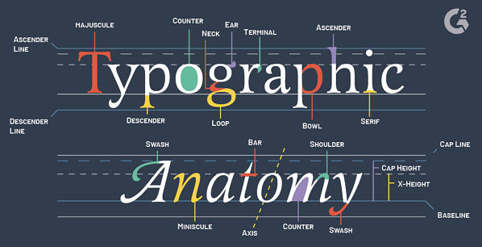
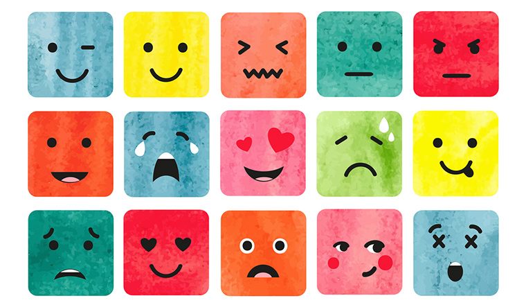
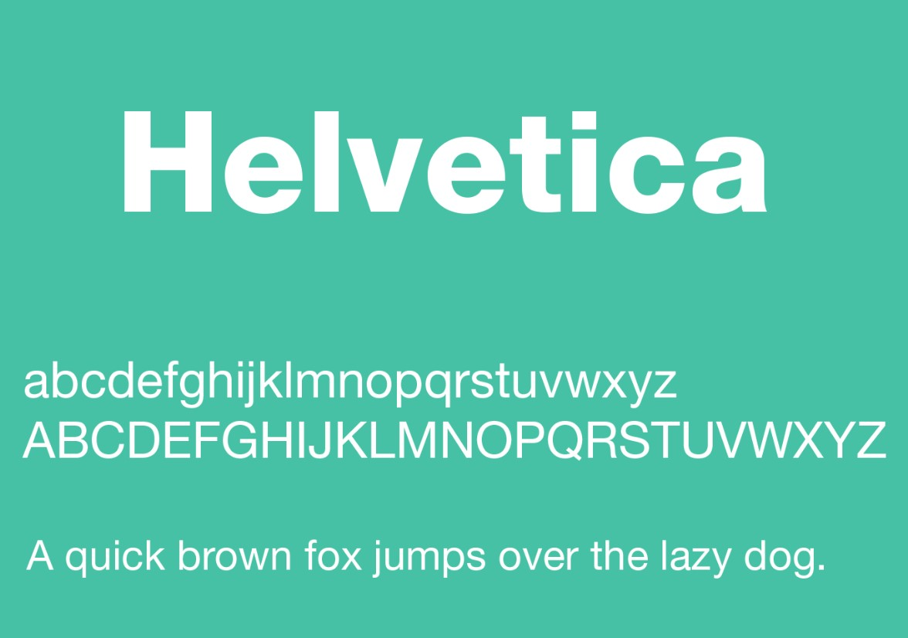
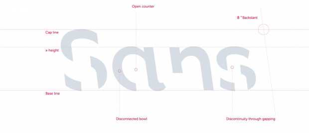

We spend a large part of our day to day lives digesting the written word. Whether it’s in books or newspapers or on our phones or tablets. We understand the importance and power of the written word but we may overlook the power of typography. Designers take the time to choose a specific typeface that will resonate with the text and enhance the reading experience. 

## 
What is Typography and Why is it Important?

Typography is “the art of arranging letters and text in a way that makes the copy legible, clear, and visually appealing to the reader”.
It involves font style, appearance and structure in the hopes of creating a great user interface design and bringing the text to life. It is a very important part of creating a text as typography: 

* Builds brand recognition
* Influences decision making 
* Holds the attention of the readers 

The main groups of typography are:

* Serif- has a decorative stroke at the end of letters
* Sans Serif- does not have a decorative stroke 
* Decorative

## \
What is the Difference Between Typeface and Font?

A typeface is a family of related fonts and a font specifies a weight, width and style of that particular typeface. 
For example, Times New Roman is a popular typeface. Whilst 12 point Times New Roman and 10 point Times New Roman are separate fonts of the same typeface. 

## 
Linking Emotions to Typeface

Type choice has the ability to express different moods, emotions and atmospheres. Linking emotions to typeface is very similar to linking emotions to colours and it leaves a lot of room for personal interpretation. However, there are some emotions linked to each of the main groups of typeface. 

Serif:
•	Tradition 
•	Respect 
•	Reliable 
•	Comfort 

Sans Serif:
•	Stability 
•	Objectivity
•	Clean
•	Modern
•	Strong
•	Chic

Script:
•	Elegance
•	Formal
•	Affectionate 
•	Creativity 
•	Personal 

## 
What is the Most Used Typeface? 

Helvetica is the world’s most popular font. This is due to it being very easy to read because its large x-height makes it appear bigger than it is. It also wants to appear neutral so that it doesn’t elicit big reactions. 
It is most commonly used on signage, invoices and receipts and for fine print on business forms. 

## 
What Typeface is used in Publishing?

There is no set rule for typeface when it comes to publishing a book. However, there are some common guidelines that designers follow to ensure readability. These include:

* Use 11 point Palatino for text
* Use 14 point Helvetica for chapter titles 
* Never use monospaced fonts
* Only use unusual fonts for short items (title and author)
* Use a maximum of 3 fonts per book 

## 
What Typeface is used for Kindle Books?

When a customer reads an eBook they get the opportunity to decide which typeface they prefer. However, designers are given some guidelines to ensure maximum readability across multiple devices and screen sizes. 
These include:

* Use only one font- and a standard font of Arial, Times New Roman or Courier 
* Safe fonts ensure nothing gets lost in conversion- fancy fonts can get converted into symbols or strange characters accidentally
* Use 12 point for body text and 14 point for chapter headings

## \
What is the Oldest Font in the World?

[Blackletter](<https://www.sitepoint.com/the-blackletter-typeface-a-long-and-colored-history/#:~:text=The%20Blackletter%20typeface%20(also%20sometimes,first%20books%20printed%20in%20Europe.&text=Blackletter%20typefaces%20are%20based%20on%20early%20manuscript%20lettering.>) is the oldest typeface in the world. It is also known as Old English, Gothic or Fraktur. It was created in 1150 and used until the 17th century in Western Europe. 
It has dramatic thick and thin strokes making it suitable for writing logos, signs and heading of posters. Blackletter is not easily readable and so does not suit body text. 

## 
What Typeface is Best for Memory?

Font size does not have an effect on memory but font style does. Research shows that people retain more material when they study it in a font that is not just unfamiliar to them but also harder to read.
Melbourne’s RMIT University create a new typeface called [Sans Forgetica ](https://sansforgetica.rmit.edu.au/)which is custom designed to help readers remember what they just read. The font was tested on 400 students and 57% successfully remembered the text compared to the 50% that remembered it after reading it in Arial. 
Sans Forgetica has two unique design features to accomplish this:

1. There are gaps within the letterforms which force readers to mentally fill in the blank spaces and slow down the reading pace
2. The font has an unusual back slant which makes sentences more difficult to read