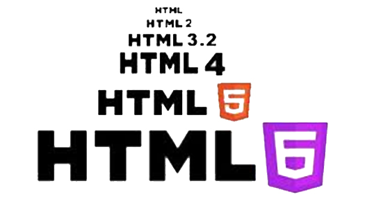

Some of the people responsible for transforming the internet and modern technology are household names, such as Steve Jobs and Bill Gates. But there are people who came before them that are responsible for developing the inner workings of the internet that we cannot name, even in the age of hyper-information that they created. 

One of the key players is [Tim Berners-Lee](https://en.wikipedia.org/wiki/Tim_Berners-Lee). He is a British computer scientist and academic that is credited with inventing the World Wide Web (WWW or W3) in 1989. 

The World Wide Web is an information space where documents and web resources can be accessed via the Internet using a web browser. The World Wide Web is the primary tool that billions of people use to interact on the Internet and it has changed people’s lives significantly. 
Berners-Lee also invented the first web browser in 1990 called WorldWideWeb and later renamed Nexus. Since then other major web browsers such as Internet Explorer, Google Chrome and Safari have been invented.\
His accomplishments led him to be named one of Time magazine’s 100 most important people of the 20th century. 

## What is HTML?

Tim Berners-Lee was also the primary author of HTML, whose first version was released in 1993. HTML stands for **H**yper **T**ext **M**arkup **L**anguage and it is the authoring language used to create documents on the web. All websites must be written with a combination of HTML and CSS (**C**ascading **S**tyle **S**heets). HTML is the website’s skeleton, defining the structure and layout, basic looks and any special functions. HTML does this by using tags written in angle brackets, such as 
 for a paragraph break, that are not displayed on the website but are used to interpret the content of the page. 
You can find an introduction on using HTML for the first time [here. ](https://www.w3schools.com/html/)

## HTML5

Since the creation of HTML in 1993 there have been many different versions of HTML. The latest version that we use today is called HTML5. This new version, released in 2014, has new features and a larger set of technologies allowing for more powerful and diverse websites. 

### New features of HTML5 include:

* **Semantics:** allowing you to describe more precisely what your content is.
* **Connectivity:** allowing you to communicate with the server in new and innovative ways.
* **Offline and storage:** allowing webpages to store data on the client-side locally and operate offline more efficiently.
* **Multimedia:** making video and audio first-class citizens in the Open Web.
* **2D/3D graphics and effects:** allowing a much more diverse range of presentation options.
* **Performance and integration:** providing greater speed optimisation and better usage of computer hardware.
* **Device access:** allowing for the usage of various input and output devices.
* **Styling:** letting authors write more sophisticated themes.

## The Timeline of HTML

