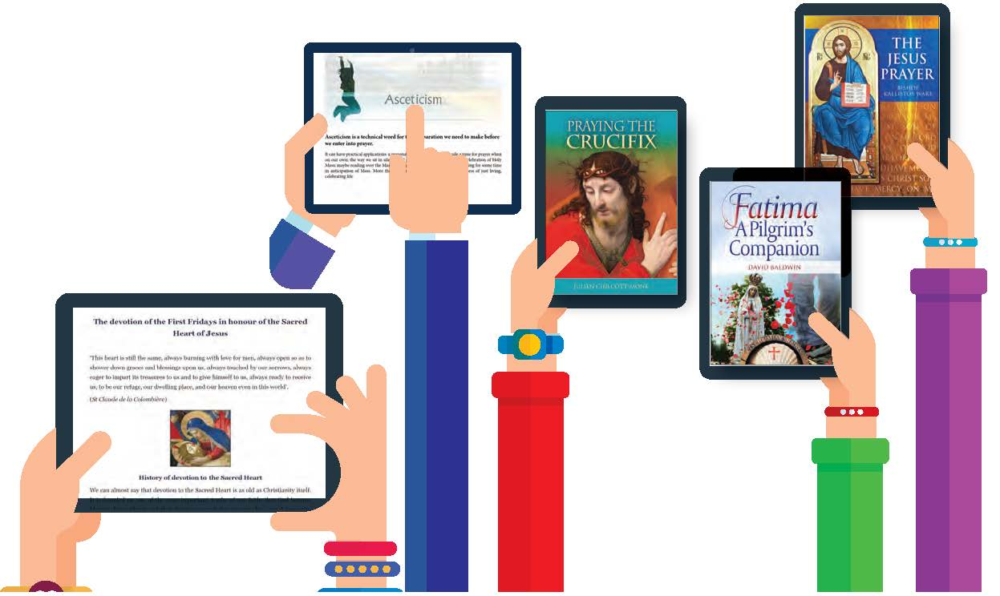
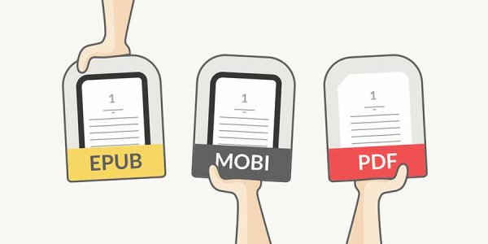
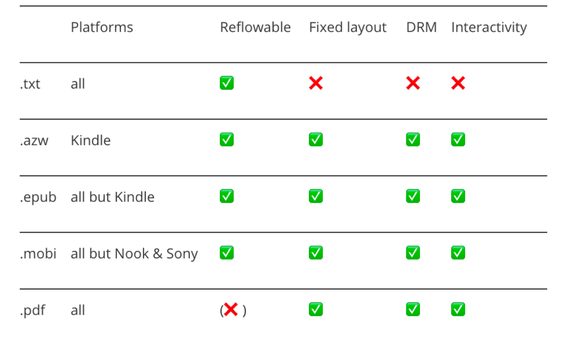
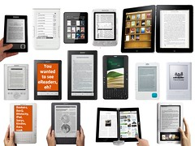

eBooks have a longer history than many may think. In 1971, Project Gutenberg was launched. It is the oldest digital library whose aim is to ‘encourage the creation and distribution of eBooks’. Digitalising books became common practice after that and in 1998 the first e-reading devices, Rocket Ebook and Softbook, were released. However, the e-reading breakthrough only happened in 2007 with the release of the Amazon Kindle Paperwhite. 

## What are eBooks? 

eBooks, or electronic books, is a non-editable, reflowable book in a digital format that is read on a digital device. 

### Advantages of eBooks:

* **Speed:** book can be downloaded immediately
* **Portability**: multiple books can be carried on one device - ideal for travellers
* **Print on demand:** books out of print will always be available 
* **Interactivity:** readers can take notes, underline, bookmark pages, search and use hyperlinks
* **Personalisation:** back-lighting and font size can be increased
* **Add-ons:** eBooks have searchable text, dictionaries or other features 
* **Open market:** writers can bypass the publishing process, increasing self-publishing 
* **Environmentally friendly:** paper-free books save trees
* **Cost effective:** eBooks are usually cheaper than print books 

### Characteristics of an eBook

eBooks are files that you can read on digital devices. However, since other files can also be read on digital devices (e.g. word documents, docx) eBooks have specific characteristics that differentiate them.  

* **Text is not editable:** they are formatted so that readers cannot alter the text without the author’s permission, just like a paperback book. 
* **Text is reflowable:** true eBooks should be reflowable, meaning that content will resize to fit the proportions of the device that you are reading on. PDFs are considered ‘unofficial’ eBooks as they cannot be edited and are not reflowable. 
* **eBooks can be personalised:** as the layout is not fixed, one can customise it to suit your own needs. Font, size, line spacing can all be changed for increased visibility. 

## The Different eBook Formats 

Publishers and writers have many different formats to choose from when creating eBooks. eBook readers usually prefer a specific format but most will accept multiple formats. The differences between the formats consider how they handle fixed-layout and reflowable books, if they support DRM for digital copy protection and whether they support pictures and multimedia content. 

### Popular eBook Formats:

* **EPUB:** the most widely supported format (everything but Kindle), for reflowable text.
* **AZW and AZW3:** formats used in Amazon Kindle devices, can store complex content like bookmarks, annotations and highlights. Supports reflowable and fixed layout books.
* **MOBI:** Amazon’s first format that can be read on almost any device. It does not support sound or video in its files. 
* **PDF:** Portable Document Formats are not reflowable so, not a true eBook. However, it is the most commonly used. 
* **IBA:** exclusive to Apple devices. IBA supports sound, image, video and other interactive digital elements. 

### Lesser Known eBook Formats:

* **LRS, LRF and LRX:** for Sony eReaders only 
* **FB2:** can store metadata within the file and is easily convertible into other formats 
* **DJVU:** can store 100 monochrome text lines in less than 1MB memory 
* **RFT:** for reflowable text, compatible with almost all eReaders 

## Different eBook Devices & How they Differ 

eBooks can be read on dedicated e-reader devices or on any digital device that has a controllable screen, such as desktop computers, laptops, tablets and smartphones. 

### Popular eReader devices include:

* Kindle 
* Kobo
* Nook

  