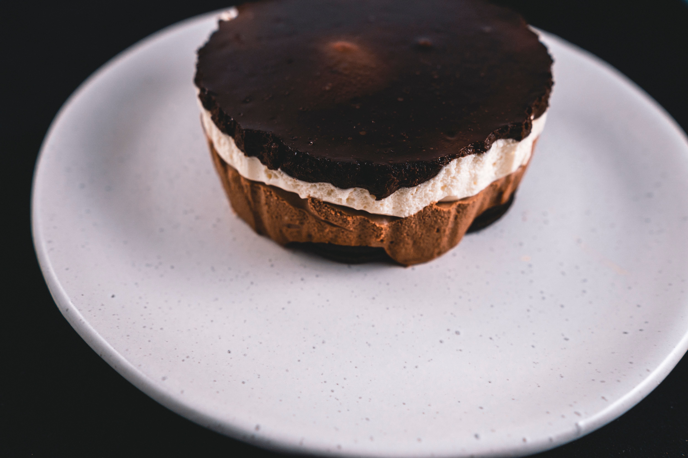
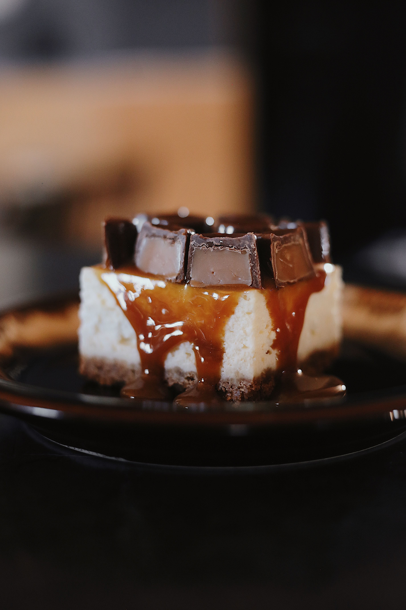

This rich and decadent cheesecake recipe will be every sweet tooth's favourite. It is quick and easy to make, so, is perfect for every first time cook. Yet it tastes expertly made. 

## Ingredients

### Crust

* 3 tablespoons unsalted butter, melted
* 1 1/4 cups chocolate wafer cookies, finely crushed 
* Butter, for greasing pan 

### Filling

* 32 ounces cream cheese, softened
* 1 3/4 cups sugar
* 4 large eggs
* 3/4 cup heavy cream
* 4 ounces milk chocolate, melted and cooled
* 4 ounces white chocolate, melted and cooled
* 4 ounces bitter chocolate or semisweet chocolate, melted and cooled

### Chocolate Glaze

* 1/2  cup heavy cream
* 4 ounces bitter chocolate or semisweet chocolate

## Method

### Crust

Preheat oven to 350F. In bowl, mix melted butter and crumbs. Press over bottom of 10-in. springform pan. Bake 8-10 minutes until set. Cool on rack. With butter, grease pan sides. Wrap outside of pan with heavy-duty foil; refrigerate. Reduce oven to 325F. 

### Filling

In large bowl with electric mixer on medium-high speed, [beat ](https://www.thespruceeats.com/definition-of-beat-3883684#:~:text=The%20word%20beat%20usually%20means,the%20ingredients%20along%20with%20air.)cream cheese 2-3 minutes until fluffy. Gradually beat in sugar until smooth. With mixer on medium speed, beat in eggs, 1 at a time, just until incorporated. Beat in cream. Divide batter evenly among 3 medium bowls (about 2 1/2 cups each). Stir melted milk chocolate into one bowl, white chocolate into next, and bittersweet chocolate into last. Pour milk chocolate batter into prepared crust in even layer. Pour and spread white chocolate batter over milk chocolate layer; don't let batters run together. Top with bittersweet chocolate layer, carefully spreading evenly. Set springform pan in centre of a large roasting pan: place on oven rack.   Pour boiling water into roasting pan to reach halfway up springform pan. Bake 2 hours or until set. Turn off oven; let stand in oven 1 hour. Transfer springform pan to rack; let cool completely. Remove foil. Cover; refrigerate at least 8 hours or overnight. 

### Glaze

In saucepan, heat cream to a gentle boil. Place chocolate in bowl, add cream. Let stand 1 minute; whisk until smooth. Pour over top of cheesecake; spread to edges. Chill for 15 minutes or until set. Run thin-bladed knife around edge of pan; carefully remove pan side. Transfer cake to serving plate. Let stand at room temperature for 1/2 hour. Garnish top edge of cake with toasted slice almonds, if desired. 

* Serves: 24
* Preparation time: 1 hour