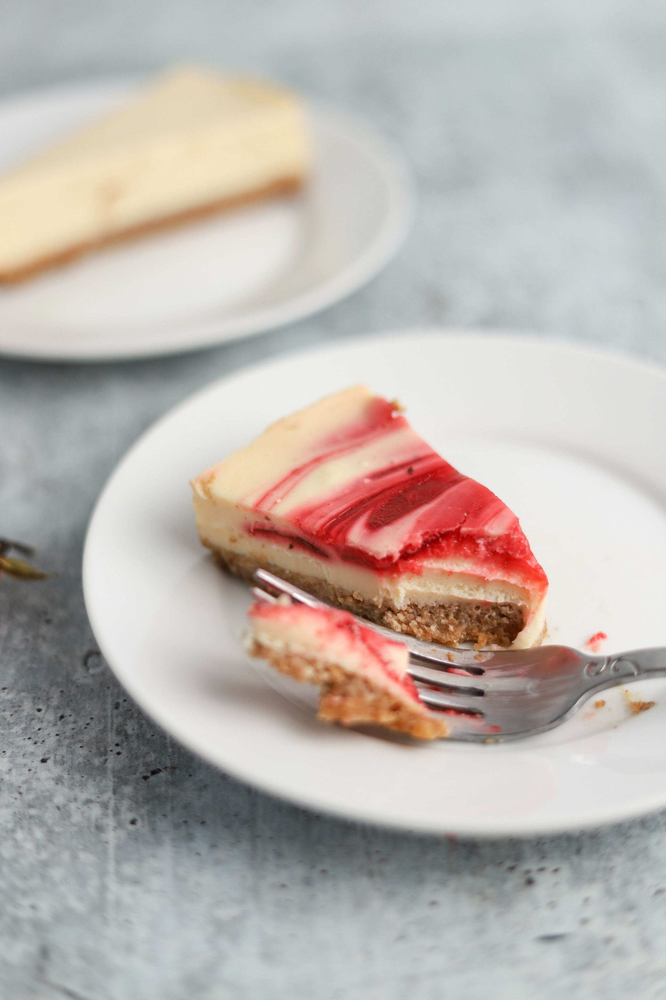

This sophisticated cheesecake will suit every palette. It tastes light and delicious and will be the perfect addition to any spring-time dinner party. 

## Ingredients 

### Crust 

* 1 1/4 cups vanilla wafer crumbs
* 1/4 cup cocoa powder
* 1/4 cup powdered sugar
* 1/4 cup unsalted butter, melted 

### Filling 

* 24 ounces cream cheese, softened
* 1 cup sugar, divided
* 1 1/2 teaspoons vanilla, divided
* 3 eggs, at room temperature
* 1/4 cup cocoa powder
* 1 tablespoon vegetable oil
* 2/3 cup red raspberry jam, seedless
* 3 tablespoons flour

## Method 

### Crust

Preheat oven to 350F. Combine crumbs, cocoa, and sugar and stir in butter. Press mixture onto bottom of a 9-inch springform pan. Bake for 8-10 minutes and leave to cool.

### Filling 

Preheat oven to 425F. Beat cream cheese, 3/4 cup sugar and 1 teaspoon of vanilla until smooth. Add eggs, beat until well-blended. In small bowl, stir together cocoa and remaining 1/4 cup sugar. Add oil, remaining 1/2 teaspoon of vanilla and 1 1/2 cups of cheese mixture; blend well. Add raspberry jam and flour to remaining cheese mixture and blend well. Pour half of raspberry mixture into pan, dollop with about half of chocolate mixture on top. Repeat with remaining mixture ending with chocolate dollops on top. Gently swirl with knife.  Bake for 10 minutes. Reduce oven temperature to 250F and continue baking for 55 minutes.

Serves: 24

Preparation time: 1 hour