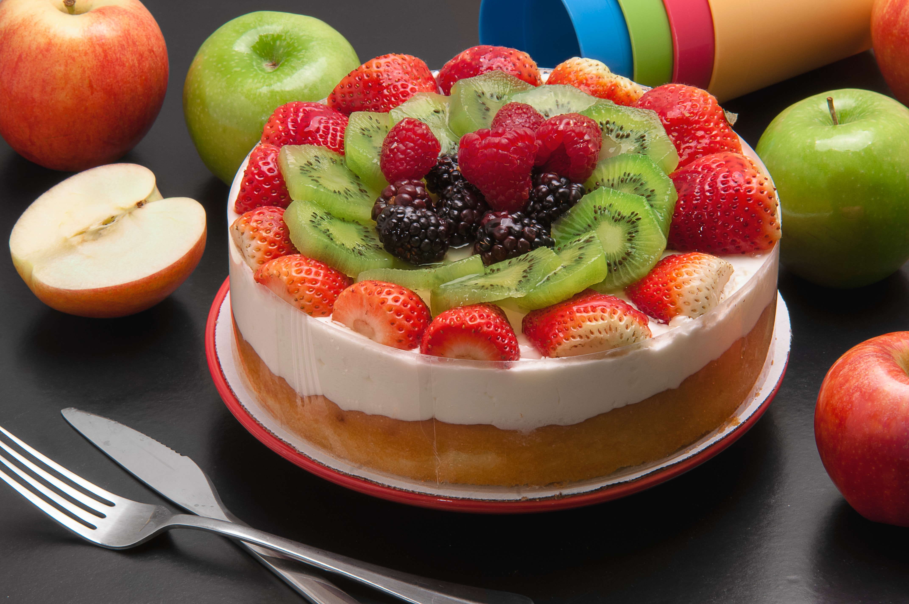

This is the easiest cheesecake recipe you'll find! A great recipe for last minute guests and it tastes superb. 

## Ingredients

### Crust

* 1 cup cornflakes or graham cracker crumbs 
* 2 tablespoons sugar 
* 1/2 teaspoon cinnamon
* 1/3 cup melted margarine 

### Filling

* 1 package cream cheese, softened
* 1 can sweetened condensed milk 
* 1/3 cup lemon juice 
* 1 teaspoon vanilla 

## Method

### Crust

Mix together crumbs, sugar, and cinnamon add margarine and blend. Set aside 2 tablespoons of mixture. Line bottom of a 9-inch pan with crumbs. Refrigerate.  

### Filling

Beat cheese until fluffy, blend in milk, blend in lemon juice and vanilla. Pour into chilled crust. Sprinkle with set aside crumbs. Refrigerate at least 3 hours before serving. May be doubled and put in 9x13-inch pan. You can make the sweetened condensed milk. I make the milk in the blender and add the cream cheese, lemon juice and vanilla to the milk in the blender.

Serves: 12

Preparation time: 30 minutes