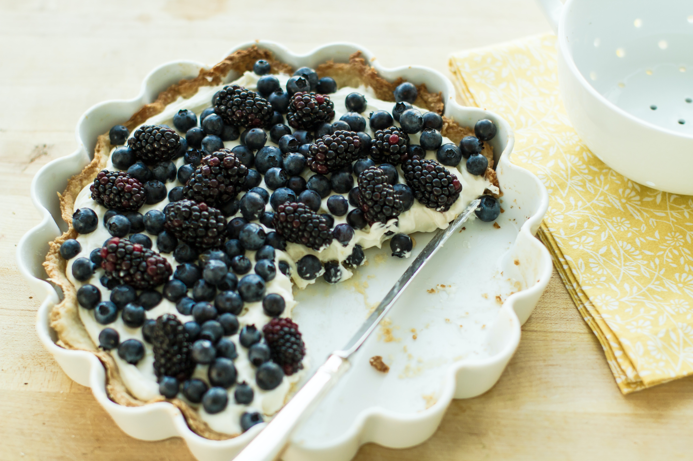

This spring-time recipe is everyone's favourite. It tastes light and fluffy and is super easy to make. You can make it your own by adding more delicious blueberries to taste, or filling it with a generous helping of white chocolate to make it sweeter and more of a treat. 

## Ingredients

### Crust

* 1 cup hazelnuts, roasted, ground 
* 1/2 cup brown sugar
* 4 tablespoons butter, melted 

### Filling

* 4 ounces white chocolate, finely grated 
* 8 ounces cream cheese, softened
* 1/4 cup sour cream 

### Topping

* 2 cups blueberries 
* 1/4 cup sugar 
* Zest of one lemon 
* White chocolate shavings 

  

## Method

### Crust

Line bottom of a 9-inch tart pan with parchment paper. Mix crust ingredients and press into pan bottom and slightly up the sides. Chill.

### Filling

Melt white chocolate in double boiler over hot but not boiling water. Stir constantly. In a separate bowl, whip cream cheese for 3 minutes. Add the melted white chocolate; beat for another minute. Add sour cream; beat until very smooth. Using a star tip and pastry bag, pipe filling to the crust in concentric circles, starting in the centre. Fill entire crust; chill until firm.

### Topping

Rinse fresh blueberries and toss with the 1/4 cup sugar. Heap the blueberries on top of the filling. Garnish with lemon zest and white chocolate shavings.

* Serves: 8
* Preparation time: 1 hour