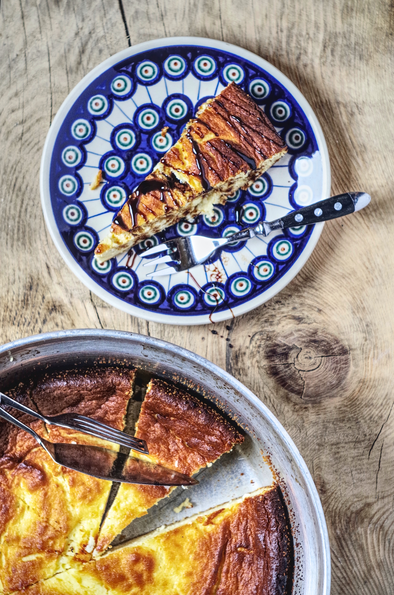
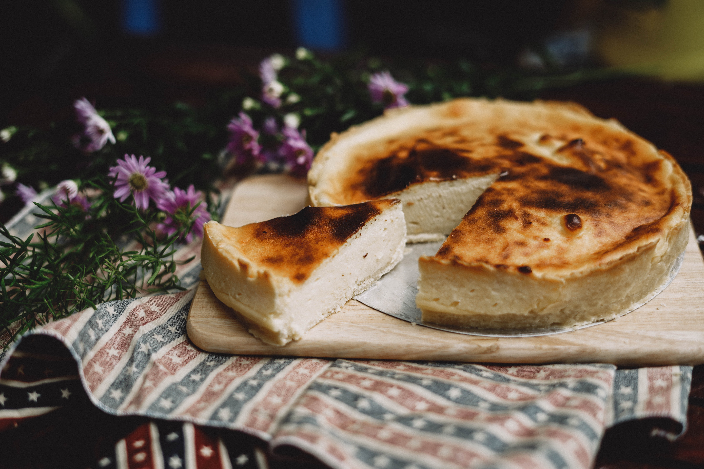
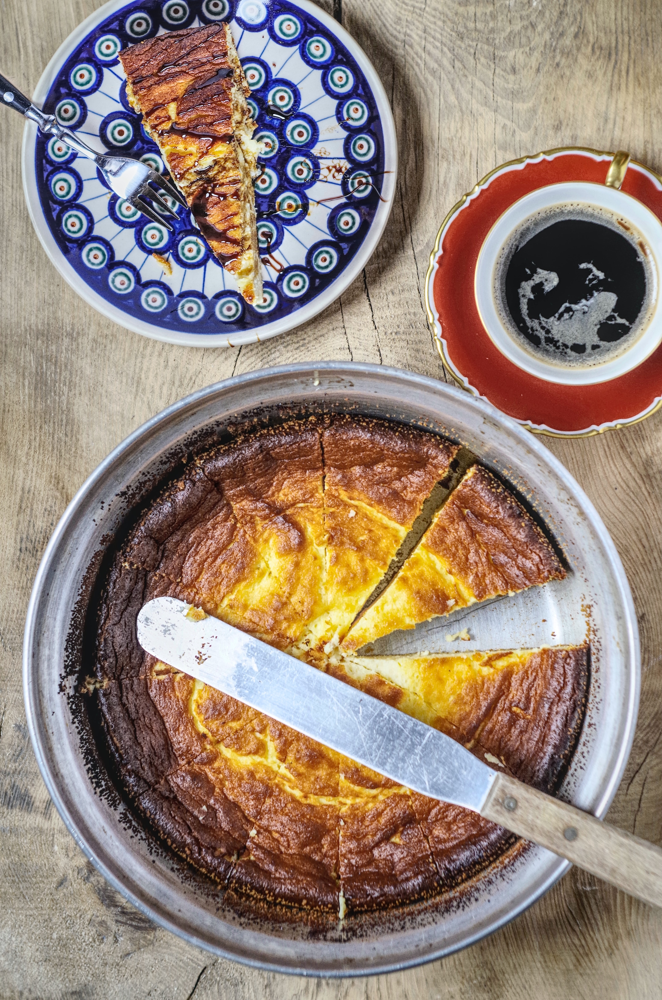

This wacky cheesecake recipe will make you the talk of the town. It's perfect for those who don't like their food too sweet and it tastes as good as it looks. 

## Ingredients

### Crust 

* 1 1/2 cups graham cracker crumbs 
* 1/4 cup granulated sugar 
* 1/3 cup butter, melted

### Filling 

* 3 ounces cream cheese, soft 
* 1 cup granulated sugar 
* 1/4 cup light brown sugar 
* 1 3/4 cups sweet potatoes, mashed 
* 2 eggs 
* 2/3 cup evaporated milk, undiluted 
* 2 tablespoons corn starch 
* 1/4 teaspoon ground cinnamon 
* 1/8 teaspoon ground nutmeg 

### Topping 

* 2 cups sour cream, room temperature 
* 1/3 cup granulated sugar 
* 1 tablespoon vanilla extract 

## Method 

### Crust

Combine crumbs, sugar, and butter in a bowl. Press onto bottom and 1 inch up on sides of a 9 inch springform pan. Bake at 350 degrees F for 6 to 8 minutes. Do not allow to brown. Remove from oven and cool.

### Filling  

Beat cream cheese, sugar and brown sugar in a large bowl. Beat sweet potatoes, eggs, and milk. Add corn starch, cinnamon and nutmeg. Beat well. Pour into crust. Bake at 350 degrees F for 55 to 60 minutes or until edge is set.

### Topping

Combine sour cream, sugar and vanilla. Spread over warm cheesecake on wire rack. Remove side of pan and chill for several hours or overnight.

* Serves: 12
* Preparation time: 45 minutes